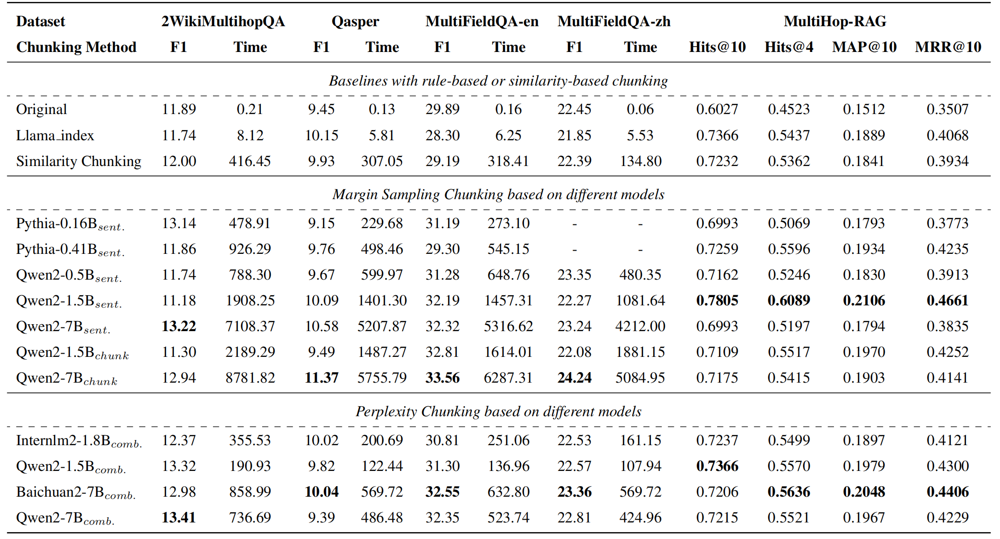
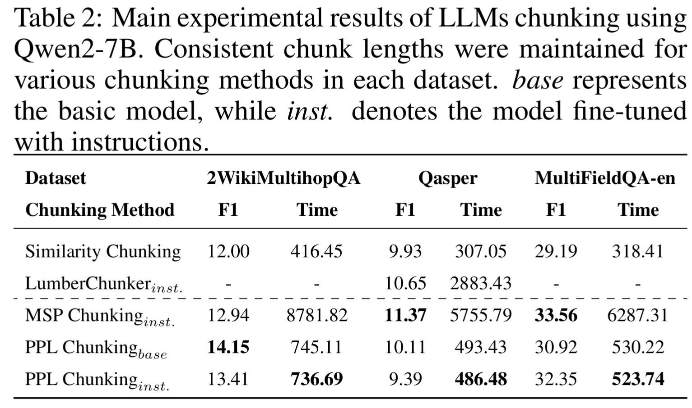
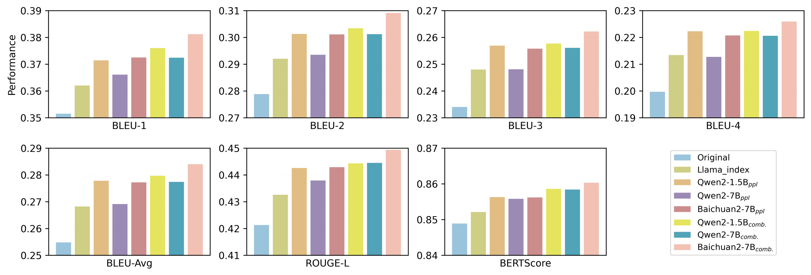

<h1 align="center">
    Meta-Chunking: Learning Efficient Text Segmentation via Logical Perception
</h1>
<p align="center">
    <a href="https://arxiv.org/abs/2410.12788">
        
    </a>
    <a href="https://huggingface.co/papers/2410.12788">
        
    </a>
    <a href="https://opensource.org/license/apache-2-0">
        
    </a>
</p>

**Meta-Chunking** leverages the capabilities of LLMs to flexibly partition documents into logically coherent, independent chunks. Our approach is grounded in a core principle: allowing variability in chunk size to more effectively capture and maintain the logical integrity of content. This dynamic adjustment of granularity ensures that each segmented chunk contains a complete and independent expression of ideas, thereby avoiding breaks in the logical chain during the segmentation process. This not only enhances the relevance of document retrieval but also improves content clarity.

> **Note:** Perplexity is a metric used to measure a language model's ability to predict text. It reflects the degree of uncertainty in generating the next token or sentence given a specific context. Our initial intuition was also to ensure that, during chunking, we split the text at points of certainty and keep it intact at points of uncertainty. This approach is more beneficial for subsequent retrieval and generation. Therefore, in fact, perplexity-based chunking leverages the hallucinations of language models to perceive text boundaries (relative to the boundaries of models), thereby ensuring that chunks are not split at points where language models hallucinate, avoiding the introduction of more hallucinations during retrieval and question answering by LLMs.

## Todo

**We intend to develop this project into a plug-and-play chunking library that incorporates various cutting-edge chunking strategies for LLMs**. While you can use Llama_index for traditional chunking methods, it may be difficult for this library to keep up with the latest chunking technologies. Therefore, we will regularly reconstruct methods from excellent chunking papers into interfaces and add them to the library, making it easier for your system to integrate advanced chunking strategies.

> Currently, all methods are maintained in the **tools** folder. The **eval.ipynb** file demonstrates usage examples of different chunking method interfaces, while each of the other files represents a specific LLMs chunking method.

- ✅ Release PPL Chunking and Margin Sampling Chunking
- ✅ 1. Refactor methods in Meta-Chunking into several interface formats for easy invocation.
    - ✅ PPL Chunking: Strategically introduce the KV caching mechanism to achieve PPL Chunking for both short and long documents (🚀 A Swift and Accurate Text Chunking Technique🌟). 
    - ✅ Margin Sampling Chunking: A binary classification judgment is made on whether consecutive sentences need to be segmented, based on the probability obtained through margin sampling to make decisions.
    - ✅ Dynamic combination: To accommodate diverse chunking requirements, a strategy of dynamic combination is introduced to assist in chunking, achieving a balance between fine-grained and coarse-grained text chunking.
- ✅ 2. Integrating [LumberChunker](https://github.com/joaodsmarques/LumberChunker): Refactoring it into an interface for convenient invocation; combining it with our margin sampling method to overcome the limitation of the original project's inability to use local small models.
- ✅ 3. Integrating [Dense X Retrieval](https://github.com/chentong0/factoid-wiki): Refactoring it into an interface for convenient invocation.
- ✅ 💡 We have integrated the aforementioned methods and released the first version of Python package for language model chunking, named `lmchunker`. You can install and use it with the command: `pip install lmchunker`. For specific usage instructions, please refer to `tools/lmchunker_eval.ipynb` and `tools/lmchunker_usage.ipynb`. We will continue to improve and update it in the future. Looking forward to your use!
- ✅ 😀 4. We are showcasing a novel text chunking approach, `MoC`, thereby initiating a fresh chapter in intelligent text processing! 🔥🔥🔥
- [ ] ......
- [ ] Our follow-up work


## Highlights

- Introduces the concept of Meta-Chunking, which operates at a granularity between sentences and paragraphs.

- Propose two implementation strategies: Margin Sampling (MSP) Chunking and Perplexity (PPL) Chunking.

- Put forward a Meta-Chunking with dynamic combination strategy designed to achieve a valid balance between fine-grained and coarse-grained text segmentation.

- Extensive experiments were conducted on eleven datasets across four benchmark.

## Quick Start

```
# Install dependencies
conda create -n MetaChunking python=3.10
conda activate MetaChunking
pip install -r requirements.txt

# Run the demo
python app.py

# Utilize the interfaces in the tools folder to perform text chunking for LLMs
```
The four benchmarks used in this paper are as follows, and you can find the relevant datasets and evaluation methods through the links: [CRUD](https://github.com/IAAR-Shanghai/CRUD_RAG)，[LongBench](https://github.com/THUDM/LongBench)，[MultiHop-RAG](https://github.com/yixuantt/MultiHop-RAG)，[RAGBench](https://github.com/rudaoshi/RAG-Bench). Additionally, for quick and easy use, we provide you with the datasets and chunking results, which can be downloaded via [Google Drive](https://drive.google.com/file/d/1nUPV6hSOZHhlakmlDFPpdBCmLjI5tB_a/view?usp=drive_link). For specific configurations of chunking and evaluation for each benchmark, please refer to [Instructions.md](https://github.com/IAAR-Shanghai/Meta-Chunking/blob/main/Instructions.md).

## Results



<div align=center>
 
</div>



# Notes

- We conducted extensive experiments on four benchmarks. Since each benchmark has many parameters to set, for the reproducibility of the experiment, we set up an independent folder for each benchmark. The datasets of benchmarks and their usage can be found on GitHub.
- The **meta_chunking** folder contains chunking programs for the four benchmarks, which share the same principles and implementation methods. The **eval** folder includes evaluation methods for the four benchmarks. For a benchmark, we first divide the dataset into appropriate chunks, establish a vector database, generate answers to questions, and then evaluate the impact of chunking on relevant metrics.
- We provide a Gradio chunking program in the **example** folder, which can be operated by running app.py. You can also dynamically adjust the parameters according to your chunking needs.


## Citation

```
@article{MetaChunking,
  title={Meta-Chunking: Learning Efficient Text Segmentation via Logical Perception},
  author={Zhao, Jihao and Ji, Zhiyuan and Qi, Pengnian and Niu, Simin and Tang, Bo and Xiong, Feiyu and Li, Zhiyu},
  journal={arXiv preprint arXiv:2410.12788},
  year={2024}
}
```

